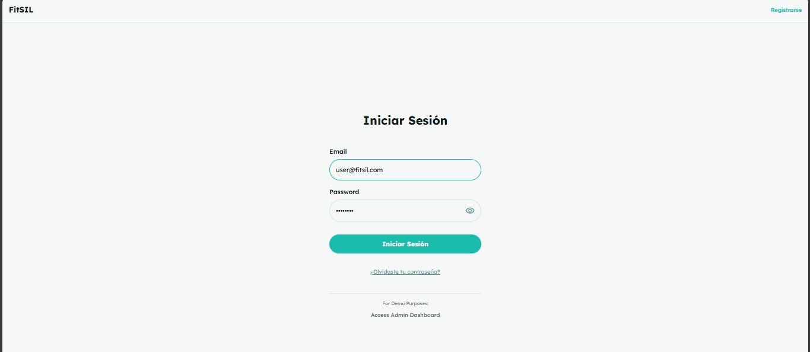
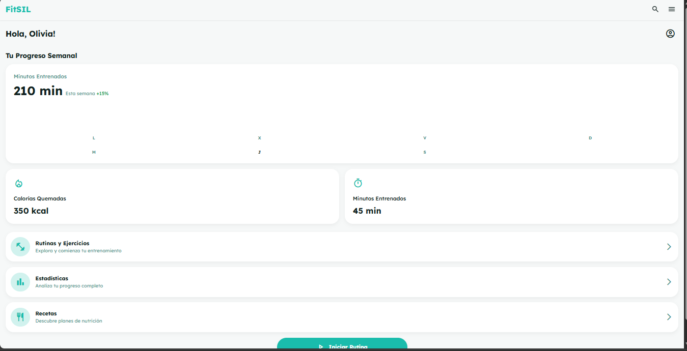
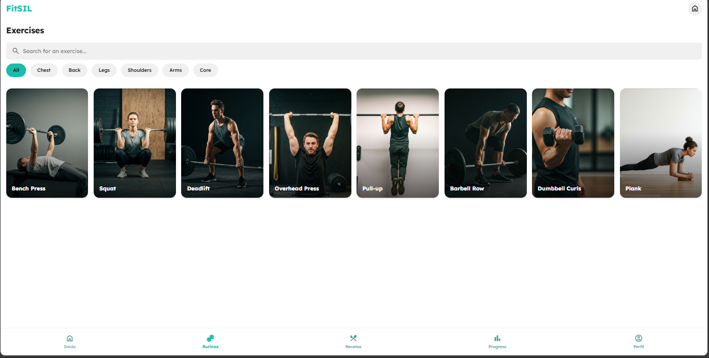
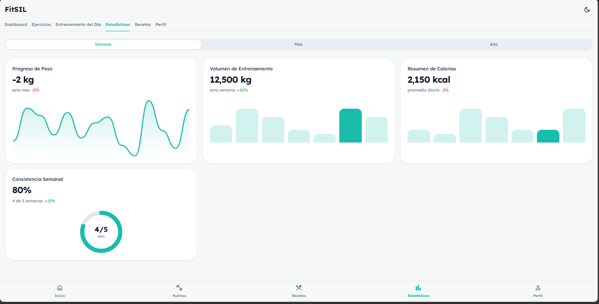
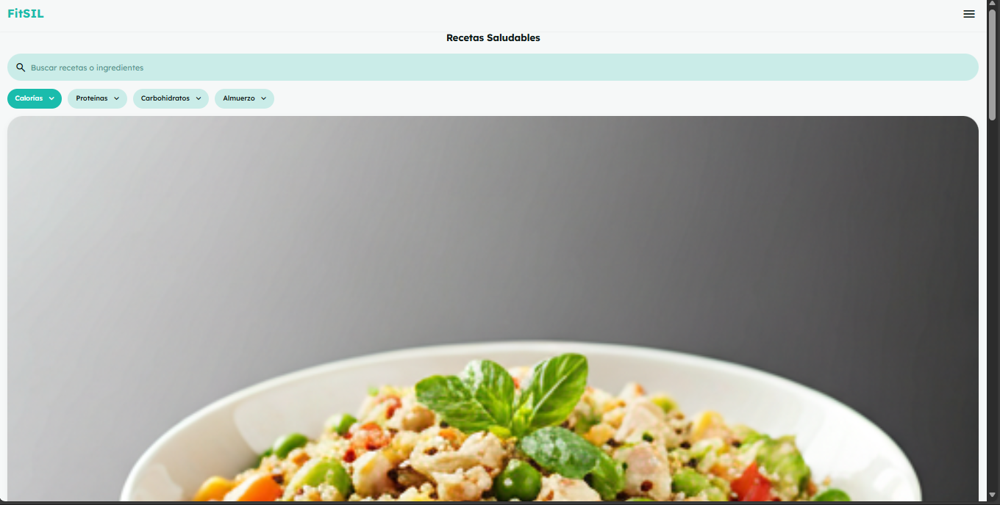
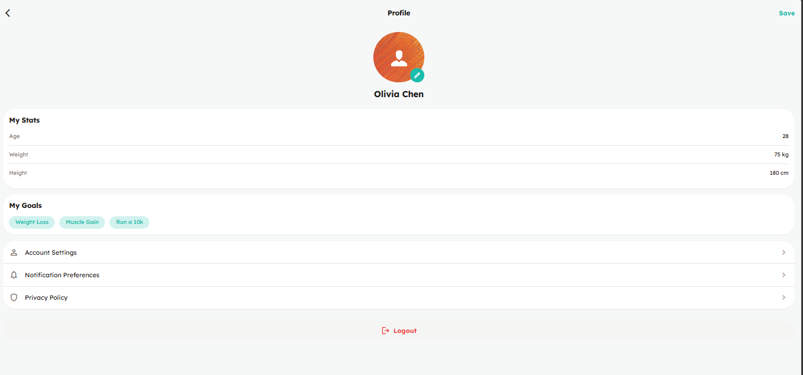
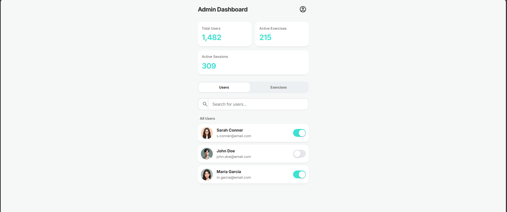

# FitSIL - Fitness Sign Language Application

## Descripción del Proyecto

FitSIL es una aplicación web de fitness diseñada para proporcionar una experiencia completa de entrenamiento, nutrición y seguimiento de progreso. La aplicación cuenta con interfaces tanto para usuarios regulares como para administradores, ofreciendo funcionalidades de gestión de ejercicios, rutinas personalizadas, recetas saludables y análisis estadístico del progreso.

## Flujo de Navegación

El flujo de la aplicación sigue la siguiente estructura:

1. **Inicio de Sesión** → Usuario ingresa credenciales
2. **Dashboard de Usuario** → Vista principal con resumen de actividad
3. **Navegación Principal** → Acceso a todas las funcionalidades:
   - Ejercicios y Rutinas
   - Entrenamiento del Día
   - Estadísticas y Progreso
   - Recetas Saludables
   - Perfil de Usuario
4. **Panel de Administrador** → Gestión de usuarios y ejercicios (acceso administrativo)

---

## Pantallas de la Aplicación

### 1. Pantalla de Inicio de Sesión (login.html)

**Propósito:** Autenticar usuarios en el sistema y proporcionar acceso a la aplicación.

**Componentes Principales:**
- Campo de entrada para email
- Campo de entrada para contraseña con botón de visibilidad
- Botón "Iniciar Sesión"
- Enlace "¿Olvidaste tu contraseña?"
- Enlace a "Registrarse"
- Enlace de demostración al panel de administrador

**Captura de Pantalla:**

---

### 2. Dashboard de Usuario (userDashboard.html)

**Propósito:** Pantalla principal del usuario que muestra un resumen de su actividad semanal y acceso rápido a las funcionalidades principales.

**Componentes Principales:**
- Saludo personalizado con nombre del usuario
- Gráfico de barras de progreso semanal (minutos entrenados)
- Tarjetas de métricas (calorías quemadas, minutos entrenados)
- Botones de navegación rápida a:
  - Rutinas y Ejercicios
  - Estadísticas
  - Recetas
- Botón flotante "Iniciar Rutina"
- Barra de navegación superior con menú hamburguesa

**Captura de Pantalla:**

---

### 3. Lista de Ejercicios (ejerciciosLista.html)

**Propósito:** Mostrar catálogo de ejercicios disponibles con filtros por categoría muscular.

**Componentes Principales:**
- Barra de búsqueda
- Filtros por categoría (All, Chest, Back, Legs, Shoulders, Arms, Core)
- Grid de tarjetas de ejercicios con:
  - Imagen del ejercicio
  - Nombre del ejercicio
- Barra de navegación inferior fija con 5 secciones
- Header con logo y botón de inicio

**Captura de Pantalla:**

---

### 4. Entrenamiento del Día (entrenamientoDia.html)

**Propósito:** Mostrar y gestionar la rutina de ejercicios programada para el día actual.

**Componentes Principales:**
- Fecha del entrenamiento
- Barra de progreso general (3/5 completados)
- Lista de ejercicios con:
  - Nombre del ejercicio
  - Detalles (sets, reps, peso)
  - Checkbox para marcar como completado
- Botón "Mark Workout as Completed" (deshabilitado hasta completar todos)
- Menú lateral desplegable
- Header con logo y botón de menú

**Captura de Pantalla:**

---

### 5. Estadísticas (estadisticas.html)

**Propósito:** Visualizar el progreso y métricas de entrenamiento del usuario a lo largo del tiempo.

**Componentes Principales:**
- Selector de período (Semana, Mes, Año)
- Tarjetas de métricas con gráficos:
  - Progreso de Peso (gráfico de línea)
  - Volumen de Entrenamiento (gráfico de barras)
  - Resumen de Calorías (gráfico de barras)
  - Consistencia Semanal (gráfico circular)
- Indicadores de cambio porcentual
- Barra de navegación inferior
- Toggle de modo oscuro

**Captura de Pantalla:**

---

### 6. Recetas Saludables (microservicioRecetas.html)

**Propósito:** Proporcionar recetas nutritivas con información calórica y de macronutrientes.

**Componentes Principales:**
- Barra de búsqueda
- Filtros dropdown (Calorías, Proteínas, Carbohidratos, Tipo de comida)
- Tarjetas de recetas con:
  - Imagen del platillo
  - Nombre de la receta
  - Descripción breve
  - Información nutricional (Kcal, Proteínas)
- Barra de navegación inferior
- Header con logo y menú

**Captura de Pantalla:**

---

### 7. Perfil de Usuario (userProfile.html)

**Propósito:** Gestionar información personal, estadísticas y configuración de la cuenta del usuario.

**Componentes Principales:**
- Foto de perfil editable
- Nombre del usuario
- Tarjeta "My Stats" con:
  - Edad
  - Peso
  - Altura
- Tarjeta "My Goals" con objetivos (chips):
  - Weight Loss
  - Muscle Gain
  - Run a 10k
- Sección de configuración:
  - Account Settings
  - Notification Preferences
  - Privacy Policy
- Botón "Logout"
- Botón "Save" en el header

**Captura de Pantalla:**

---

### 8. Dashboard de Administrador (adminDashboard.html)

**Propósito:** Gestionar usuarios, ejercicios y ver métricas generales del sistema.

**Componentes Principales:**
- Tarjetas de estadísticas del sistema:
  - Total Users (1,482)
  - Active Exercises (215)
  - Active Sessions (309)
- Pestañas de gestión (Users / Exercises)
- Barra de búsqueda
- Lista de usuarios con:
  - Avatar
  - Nombre
  - Email
  - Toggle de activación/desactivación
- Enlace al perfil de administrador

**Captura de Pantalla:**

---

### 9. Perfil de Administrador (adminProfile.html)

**Propósito:** Gestionar información del administrador y acceder a herramientas administrativas.

**Componentes Principales:**
- Foto de perfil
- Nombre y email del administrador
- Botón "Edit Profile"
- Sección "Account Settings":
  - Change Password
  - Notifications
- Sección "Admin Management":
  - Manage User Roles
  - System Permissions
  - View System Analytics
- Botón "Log Out"
- Botón de regreso al dashboard

**Captura de Pantalla:**

---

## Tecnologías Utilizadas

- **HTML5** - Estructura de las páginas
- **Tailwind CSS** - Framework de estilos
- **Google Material Icons** - Iconografía
- **Lexend/Inter** - Tipografías
- **JavaScript Vanilla** - Interacciones básicas

## Características de Diseño

- **Diseño Responsivo** - Adaptado para dispositivos móviles
- **Modo Oscuro/Claro** - Soporte completo para ambos temas
- **Color Principal** - #1abcac (turquesa/verde azulado)
- **Navegación Intuitiva** - Barra inferior fija en vistas de usuario
- **Animaciones Sutiles** - Transiciones suaves en hover y clicks

